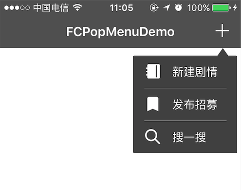

##FCPopMenu

An easy,friendly and customizable way to make a popover menu.

容易、友好且可定制的下拉菜单



###Installation 安装
>Cocoapods

pod "FCPopMenu", "~>1.0"

Use `pod repo update` if not exist.

如果pod找不到FCPopMenu，用`pod update`更新repos

>Manual 手动

Download `FCPopMenu`,drag folder "FCPopMenu" into your project, make sure to ues "create group if need".

下载FCPopMenu，并将"FCPopMenu"引用到项目中，确保勾选"create group if need"。

###Useage 使用

>FCPopMenuItem


```
[FCPopMenuItem itemWithImage:[UIImage imageNamed:@"sence_new"]
                                                title:@"新建剧情"
                                           titleColor:[UIColor whiteColor]
                                               target:self
                                               action:@selector(listClickAction:)];
```
or mutable items
```
NSArray *items=@[[FCPopMenuItem itemWithImage:[UIImage imageNamed:@"sence_new"]
                                                title:@"新建剧情"
                                           titleColor:[UIColor whiteColor]
                                               target:self
                                               action:@selector(listClickAction:)],
                         [FCPopMenuItem itemWithImage:[UIImage imageNamed:@"recruit_new"]
                                                title:@"发布招募"
                                           titleColor:[UIColor whiteColor]
                                               target:self
                                               action:@selector(listClickAction:)],
                         [FCPopMenuItem itemWithImage:[UIImage imageNamed:@"sence_search"]
                                                title:@"搜一搜"
                                           titleColor:[UIColor whiteColor]
                                               target:self
                                               action:@selector(listClickAction:)]];
```

>FCPopMenu

Create a popover menu like this
像这样创建一个下拉菜单

```
_list=[FCPopMenu menuWithFrame:CGRectMake(kFCPopMenuWidth-143, 64, 138, 140) trangleHeight:10 tranglePosition:CGPointMake(112, 0) items:items];
_list.mainColor=[UIColor colorWithRed:73/255.f green:73/255.f blue:73/255.f alpha:1.f];
_list.rowHeight=43.5;
_list.sperateColor=[UIColor colorWithRed:217/255.f green:217/255.f blue:217/255.f alpha:1.f];
_list.seperateInsets=UIEdgeInsetsMake(0, 14, 0, 14);
```
You may need a overlay view
你可能需要一个覆盖视图，在下拉菜单的下方
```
-(UIControl *)back{
    
    if(!_back){
        
        _back=[[UIControl alloc] initWithFrame:self.view.bounds];
        _back.backgroundColor=[UIColor clearColor];
        [_back addTarget:self action:@selector(hideList:) forControlEvents:UIControlEventTouchUpInside];
    }
    return _back;
}
```
Troggle show/close menu
开启/关闭菜单

```
-(void)addBtnClickAction:(UIBarButtonItem *)sender{
    
    sender.enabled=NO;
    if(self.list.superview){
        
        [self hideList:self.back];
        sender.enabled=YES;
        return;
    }
    [self.view addSubview:self.back];
    [self.view addSubview:self.list];
    self.list.alpha=0.0;
    __weak typeof(self) wkself=self;
    [self.list mas_makeConstraints:^(MASConstraintMaker *make) {
        
        make.right.equalTo(wkself.view).offset(-5);
        make.top.equalTo(wkself.view).offset(64);
        make.size.mas_equalTo(CGSizeMake(138, 140));
    }];
    [UIView animateWithDuration:0.3 animations:^{
        
        wkself.list.alpha=1.0;
    }];
    sender.enabled=YES;
}
```
Monitor click action
监听点击事件

```
-(void)listClickAction:(FCPopMenuItem *)sender{
    
    [self hideList:self.back];
    NSString *title=[sender.title copy];
    if([title isEqualToString:@"新建剧情"]){
        
        
    }else if([title isEqualToString:@"发布招募"]){
        
        
    }else{
        

    }
    NSLog(@"%@",sender.title);
}
```

Hide
隐藏
```
-(void)hideList:(UIControl *)sender{
    
    [sender removeFromSuperview];
    [self.list removeFromSuperview];
}
```
>About Me 关于我

- Blog:     [CGPointZeero](http://cgpointzero.top)
- GitHub:   [Insfgg99x](https://github.com/Insfgg99x)
- Mooc:     [CGPointZero](http://www.imooc.com/u/3909164/articles)
- Jianshu:  [CGPointZero](http://www.jianshu.com/users/c3f2e8c87dc4/latest_articles)
- Email:    [newbox0512@yahoo.com](mailto:newbox0512@yahoo.com)

-------------------------------------------------------------
@CGPoitZero

